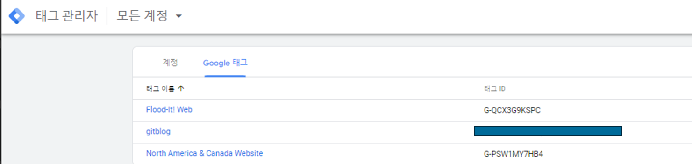
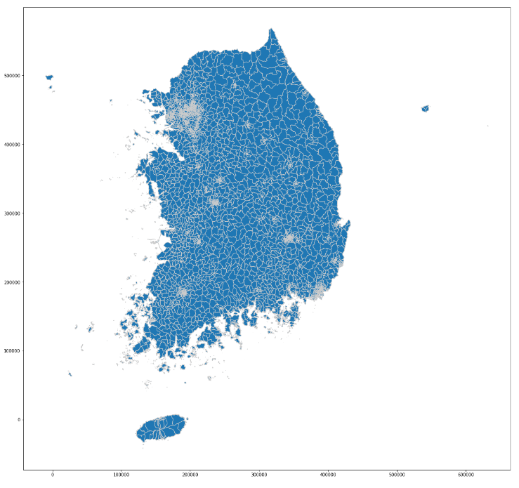
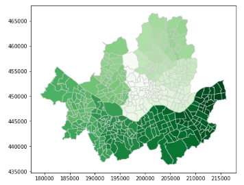
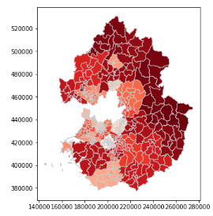
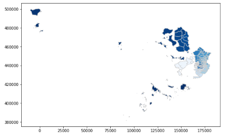
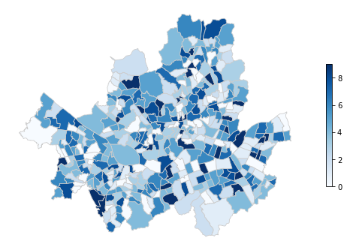

### Introduction
--- 
최근 지도 시각화를 해야 할 일이 있었는데, folium 몇 번 돌려본 경험이 다였기 때문에 꽤나 힘들었다. folium도 별로 예쁘지 않아서 여기저기 조언을 구해서 Geopandas를 사용해보기로 했는데,,, 가지고 있는 데이터랑 병합하기가 매우 힘들었다. 

행정동 단위 데이터를 병합해야 했는데, 전국에 같은 명칭의 행정동이 매우 많고, 행정동 코드의 기준이 매우 많았다. 결국 경기도는 수기로 수정해야 했다.

행정동 단위 폴리곤 데이터는 여기저기 많았으나, 최신 버전이여도 맞지 않았기 때문에 매우 힘들었다. 하지만 해야하기 때문에 했다^^

  
<br><br>

### 행정동 단위 폴리곤 데이터 수집
--- 

국내 시/도, 시/군/구, 법정동 단위의 shape 데이터는 많은 버전으로 공개되어 있다. 
<br>
[법정동 최신 행정구역(SHP)](http://www.gisdeveloper.co.kr/?p=2332)
<br><br>
추가로, 행정동 단위 데이터도 통계청에서 제공하고 있다. <br>
[통계청 행정동 경계](http://data.nsdi.go.kr/dataset/20171206ds00001)

위 데이터들을 다운받아 압축 해제 후, 사용하면 된다.

(압축폴더 내 파일은 항상 같이 존재해야 함. shp 파일만 빼서 사용하는 것이 불가능함.)

분석 데이터가 행정동 단위였기 때문에 나는 아래 행정동 버전을 사용했다.

<br><br>

### SHP 데이터 로드
--- 

```python
import pandas as pd
import geopandas as gpd

shp = 'Z_SOP_BND_ADM_DONG_PG.shp' 
p1 = gpd.read_file(shp, encoding='cp949')
p1.head()
```



geopandas를 호출한다. 시각화는 꼭 geopandas 형태인 채로 해야한다. 데이터 프레임으로 읽고 geopandas로 변환해도 되긴 함.  

<br><br>


### 시각화
---
바로 plot을 때려버리면 이렇게 나온다.
```python
import matplotlib.pyplot as plt

fig, ax = plt.subplots(1, figsize=(20, 20))

d2.plot( cmap='Blues', linewidth=0.8, ax=ax, edgecolor='0.8')
plt.show()
```

<br><br>
전국 행정동이여서 figsize를 크게 주어야하는 것 같다. 회색으로 보이는 부분은 행정동이 밀집된 부분일 수도 있고, 누락된 데이터일 수도 있다. 


참고로, 나는 수도권 지역만 필요했기 때문에 분리해서 시각화하였다. 

행정동코드는 다행히 비교적 유사해서 앞 두자리가 시/도를 의미하고 있었다. 그러나, 실제 행정동 코드와는 다름.

```python
# 서울특별시
sl = d2[d2['SIG_CD'].str.startswith('11')]
# 경기도
gg = d2[d2['SIG_CD'].str.startswith('41')]
# 인천광역시
ic = d2[d2['SIG_CD'].str.startswith('28')]
```

행정동 앞 두자리로 서울/경기/인천 지역을 구분하였다.

각각을 개별로 시각화 하면 아래와 같다.

cmap을 설정해서 색상도 변경할 수 있다.


```python
fig, ax = plt.subplots(1, figsize=(10, 6))

sl.plot( cmap='Grees', linewidth=0.8, ax=ax, edgecolor='0.8')
plt.show()
```



```python
fig, ax = plt.subplots(1, figsize=(10, 6))

gg.plot(cmap='Blues', linewidth=0.8, ax=ax, edgecolor='0.8')
```


```python
fig, ax = plt.subplots(1, figsize=(10, 6))

ic.plot( cmap='Blues', linewidth=0.8, ax=ax, edgecolor='0.8')
plt.show()
```



실제 데이터를 활용해서 시각화 할 때는 범례를 추가하거나 축 좌표를 제거하는게 좋은데, 설정은 아래와 같이 하면 된다.

```python
fig, ax = plt.subplots(1, figsize=(10, 6))
ax.axis('off') # 축 제거
sl2.plot(column='data', # 시각화 대상 데이터
            legend=True, # 범례
            cmap='Blues', # 색
            linewidth=0.8, # 테두리 굵기
            ax=ax, # 축
            edgecolor='0.8', # 테두리 색(밝기)
            legend_kwds={'shrink': 0.5}) # 범례 크기
# plt.savefig('./data.png') # 결과 png로 저장
plt.show()
```



결과는 이런식으로 나온다.

참고로 위 데이터는 가짜 데이터임.

<br>


### References
--- 
[[Geopandas] Python을 이용한 지도 데이터 시각화](!https://yoonseul.tistory.com/8)

[[GeoPandas] 파이썬 지도 시각화](https://f7project.tistory.com/425)


<br><br>